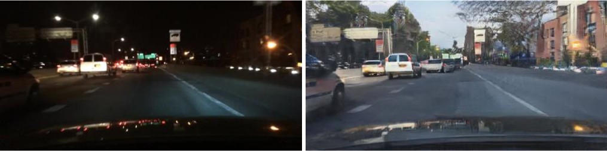
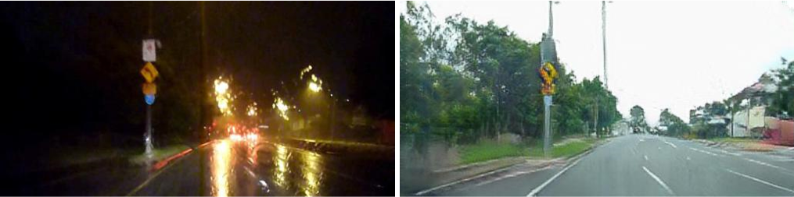
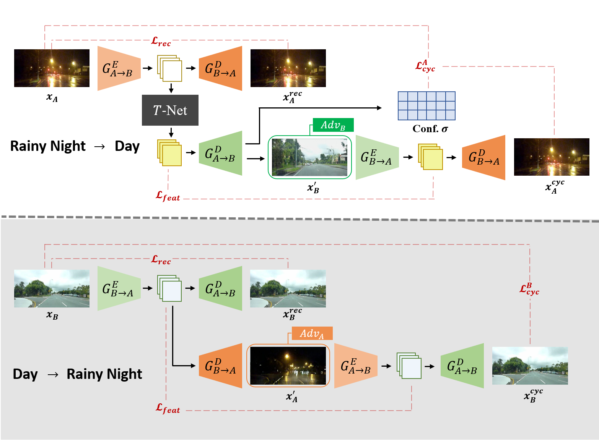
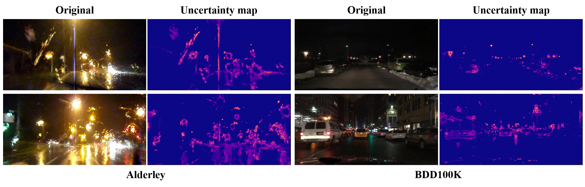

# Adverse Weather Image Translation with Asymmetric and Uncertainty-aware GAN (AU-GAN)
Official Tensorflow implementation of [Adverse Weather Image Translation with Asymmetric and Uncertainty-aware GAN](https://www.bmvc2021-virtualconference.com/assets/papers/1443.pdf) (AU-GAN)\
Jeong-gi Kwak, Youngsaeng Jin, Yuanming Li, Dongsik Yoon, Donghyeon Kim and Hanseok Ko </br>
*British Machine Vision Conference (BMVC), 2021*
</br>

## Intro 

### Night &rarr; Day ([BDD100K](https://bdd-data.berkeley.edu/))


### Rainy night &rarr; Day ([Alderdey](https://wiki.qut.edu.au/pages/viewpage.action?pageId=181178395))

</br>


## Architecture

Our generator has asymmetric structure for editing day&rarr;night and night&rarr;day.
Please refer our paper for details

## **Envs**

```bash

git clone https://github.com/jgkwak95/AU-GAN.git
cd AU-GAN

# Create virtual environment
conda create -y --name augan python=3.6.7
conda activate augan

conda install tensorflow-gpu==1.14.0   # Tensorflow 1.14
pip install --no-cache-dir -r requirements.txt

```

## **Preparing datasets**

**Night &rarr; Day** </br>
[Berkeley DeepDrive dataset](https://bdd-data.berkeley.edu/) contains 100,000 high resolution images of the urban roads for autonomous driving.</br></br>
**Rainy night &rarr; Day** </br>
[Alderley dataset](https://wiki.qut.edu.au/pages/viewpage.action?pageId=181178395) consists of images of two domains,
rainy night and daytime. It was collected while driving the same route in each weather environment.</br>
</br>
Please download datasets and then construct them following [ForkGAN](https://github.com/zhengziqiang/ForkGAN)

## Training

```bash

# Alderley (256x512)
python main.py       --dataset_dir alderley
                     --phase train
                     --experiment_name alderley_exp
                     --batch_size 8 
                     --load_size 286 
                     --fine_size 256 
                     --use_uncertainty True

```

```bash

# BDD100k (512x1024)
python main.py       --dataset_dir bdd100k 
                     --phase train
                     --experiment_name bdd_exp
                     --batch_size 4 
                     --load_size 572 
                     --fine_size 512 
                     --use_uncertainty True

```

## Test

```bash

# Alderley (256x512)
python main.py       --dataset_dir alderley
                     --phase test
                     --experiment_name alderley_exp
                     --batch_size 1 
                     --load_size 286 
                     --fine_size 256 
                    
```

```bash

# BDD100k (512x1024)
python main.py       --dataset_dir bdd100k
                     --phase test
                     --experiment_name bdd_exp
                     --batch_size 1 
                     --load_size 572 
                     --fine_size 512 
                    

```

## Pretrained model : Night to Day
You can use a pretrained model for BDD100K dataset (size: 256x512) </br>
First, download our [pretrained model](https://drive.google.com/file/d/1QUAAzFlL5Acdo0U-U-fMWXJ0fE1FG2wj/view?usp=sharing) (zip file) </br>
and then, unzip in folder --> ./check/your-exp-name/bdd100k_256/


## Additional results


Please check more results in full [paper](https://arxiv.org/abs/2112.04283) (Arxiv)

## Uncertainty map 


## Demo 
Also check the demo code implemented by Katsuya Hyodo in [Here](https://github.com/PINTO0309/PINTO_model_zoo/tree/main/251_AU-GAN). </br> 
It is optimized for ONNX, TFLite and other formats.
Thanks to him and his community members for the amazing work!

## **Citation**
If our code is helpful for your research, please cite our paper:
```
@article{kwak2021adverse,
  title={Adverse Weather Image Translation with Asymmetric and Uncertainty-aware GAN},
  author={Kwak, Jeong-gi and Jin, Youngsaeng and Li, Yuanming and Yoon, Dongsik and Kim, Donghyeon and Ko, Hanseok},
  journal={arXiv preprint arXiv:2112.04283},
  year={2021}
}
```
## Acknowledgments
Our code is bulided upon the [ForkGAN](https://github.com/zhengziqiang/ForkGAN) implementation.
